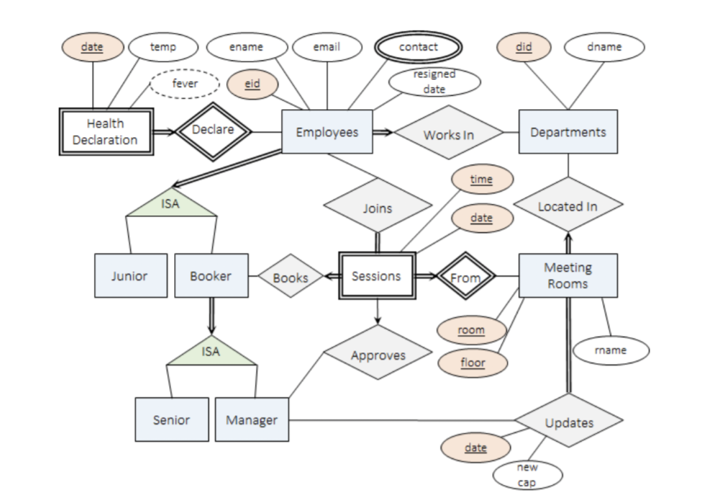

# Office Meeting Room Booking and Scheduling System

## 1. Overview
This project implements a database application for managing meeting room bookings in a company during pandemic conditions. The system enforces social distancing measures through room capacity limits and includes health declaration tracking and contact tracing functionality.

Key Features:
- Meeting room booking and management
- Employee health declarations and temperature tracking
- Contact tracing for COVID-19 exposure
- Department-based room management
- Role-based access control (Junior, Senior, Manager)
- Meeting approval workflow
- Capacity management for social distancing

---

## 2. Entity Relationship Model and Database Schema Design

### Entity-Relationship Model Diagram

*Entity Relationship Model Diagram*

### Key Design Decisions:

#### Employee Structure
- Each employee must belong to exactly one department
- Three types of employees: Junior, Senior, and Manager
- Junior employees cannot book rooms
- Only managers can approve bookings and modify room capacities
- Employees have unique IDs and email addresses generated by the system

#### Meeting Rooms
- Uniquely identified by floor number and room number
- Room names are not required to be unique
- Each room has a maximum capacity that can be modified by managers
- Rooms are associated with departments

#### Booking System
- Bookings are based on 1-hour sessions
- Rooms can only be booked by senior employees or managers
- Each booking requires approval from a department manager
- Bookings must be approved before they can be used
- Participants cannot be changed after approval

#### Health Declarations
- Daily temperature declarations required
- Fever threshold set at 37.5°C
- Contact tracing implemented for fever cases
- Automatic removal from future meetings for close contacts

### Schema Decomposition and Normalization

#### 1. Employees Table
Original Schema:
```sql
employees(eid, ename, ekind, did, resigned_date, mobile_contact, home_contact, office_contact)
```

Functional Dependencies:
- {eid} → {ename, email, ekind, did, resigned_date, mobile_contact, home_contact, office_contact}
- {office_contact} → {did}

The employees table violated 3NF due to the office_contact → did dependency. A BCNF decomposition was performed:

Decomposed Schema:
```sql
employees(eid, ename, ekind, resigned_date, mobile_contact, home_contact, office_contact)
department_contacts(office_contact, did)
```

#### 2. Health Declaration Table
Original Schema:
```sql
health_declaration(eid, declaration_date, temperature, fever)
```

Functional Dependencies:
- {eid, declaration_date} → {temperature}
- {temperature} → {fever}

BCNF Decomposition:
```sql
health_declarations2(eid, declaration_date, temperature)
temperatures(temperature, fever)
```

#### 3. Meeting Sessions Table
Schema:
```sql
meeting_sessions(room, building_floor, session_date, session_time, booker_id, endorser_id)
```

Keys:
- {room, building_floor, date, time} (Primary Key)
- {booker_id, session_date, session_time}

The table is already in BCNF as all functional dependencies are derived from the keys.

#### 4. Joins Table
Schema:
```sql
joins(eid, room, building_floor, session_date, session_time)
```

Key:
- {eid, room, building_floor, session_date, session_time}

The table is already in BCNF as all functional dependencies are derived from the primary key.

---

## 3. Synthetic Data Used

The project includes comprehensive synthetic data covering:
- 10 departments
- 60 employees (mix of juniors, seniors, and managers)
- Multiple meeting rooms across different floors
- Health declaration records
- Meeting bookings and approvals

Data was generated to test various scenarios including:
- Regular booking workflows
- Contact tracing situations
- Capacity limit enforcement
- Health declaration compliance

---

## 4. SQL Procedures and Triggers

### Key Procedures

#### Basic Operations
- `add_department`: Adds new departments
- `remove_department`: Removes departments
- `add_room`: Creates new meeting rooms
- `change_capacity`: Updates room capacity
- `add_employee`: Adds new employees
- `remove_employee`: Handles employee resignation

#### Core Booking Functions
- `search_room`: Finds available rooms
- `book_room`: Handles room booking
- `join_meeting`: Manages meeting participation
- `approve_meeting`: Processes booking approvals
- `unbook_room`: Cancels bookings

#### Health Management
- `declare_health`: Records daily temperature
- `contact_tracing`: Manages COVID-19 exposure

### Important Triggers

1. `employee_classifier_func`:
   - Classifies employees into junior/senior/manager categories
   - Maintains role-based access control
   - Ensures constraint enforcement for employee types

2. `update_capacity`:
   - Handles room capacity changes
   - Removes affected future bookings
   - Maintains social distancing requirements

3. `employee_deletion`:
   - Prevents deletion of employee records
   - Maintains data integrity for contact tracing
   - Preserves historical booking information

---

## 5. Testing

The system was tested using multiple SQL test files:

### Basic Functionality Tests (basic_tests.sql)
- Department management
- Room management
- Employee management
- Capacity changes

### Core Feature Tests (core_test.sql)
- Room searching
- Booking workflow
- Meeting participation
- Approval process

### Health Management Tests (temp_health_tests.sql)
- Temperature declarations
- Contact tracing
- Future meeting cancellations

### Administrative Tests (admin_tests.sql)
- Compliance reporting
- Booking reports
- Manager approval workflows

Other test files included:
- join_meeting_testing.sql
- view_manager_report_test.sql
- view_booking_report_test.sql
- non_compliance_test.sql
- search_room_test.sql

---

## 6. Acknowledgements
I would like to express my sincere gratitude to my teammates Chia Jia-Xi, Kymie, Jay Aljelo Saez Ting, and Samuel Paul Christopher for their dedication and collaborative spirit throughout this project. Special thanks to Prof Adi Yoga Sidi PRABAWA and Prof Christian von der Weth for their invaluable guidance and support, which helped shape our understanding of database systems and contributed significantly to the success of this project.
